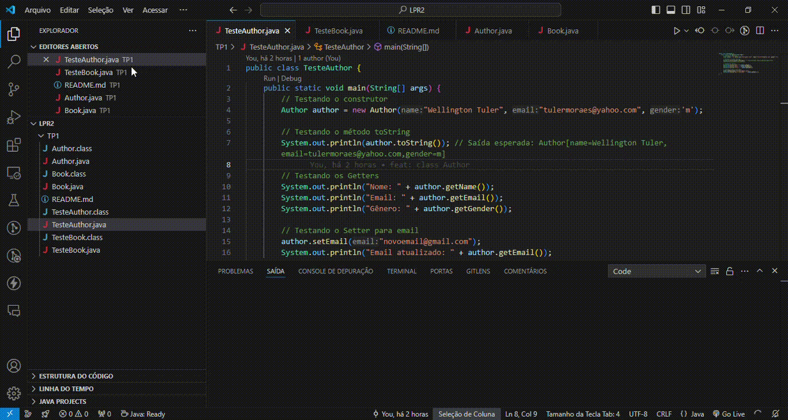
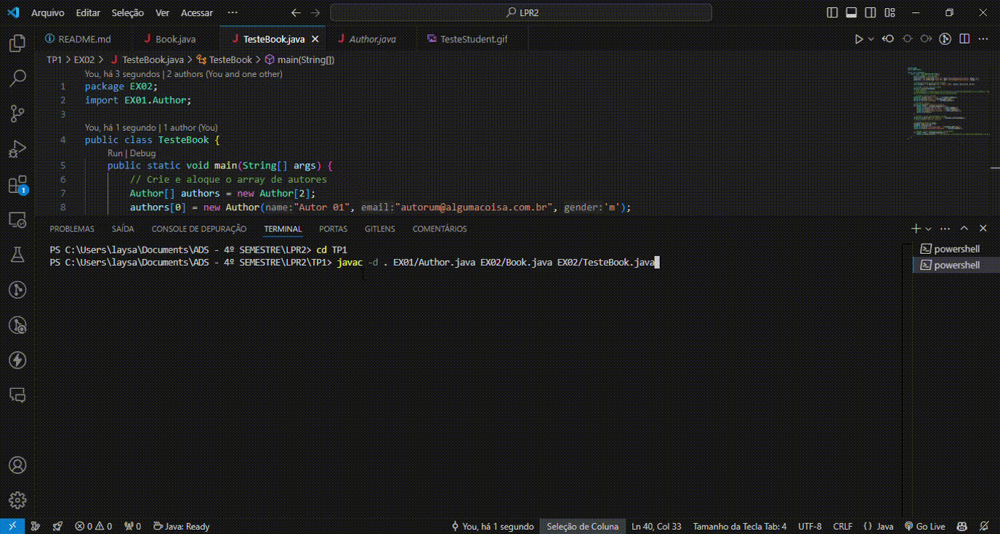
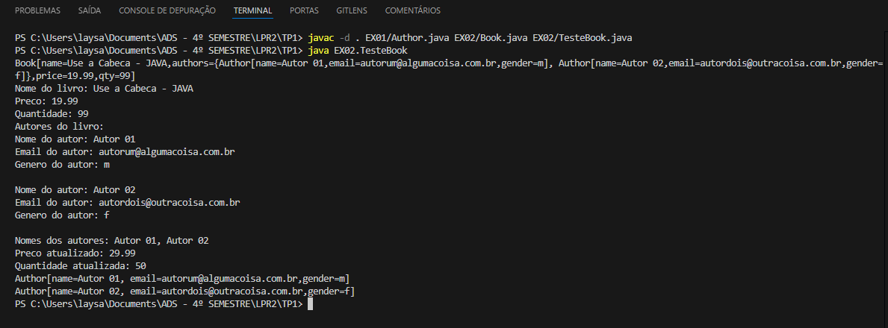
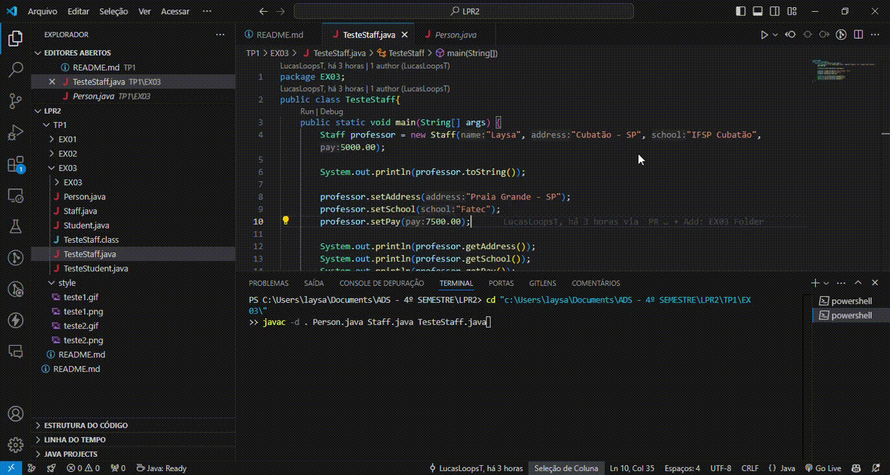
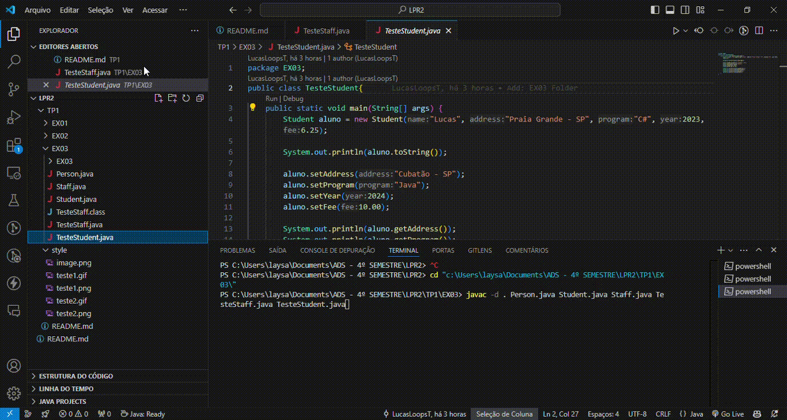


# TRABALHO PRÁTICO 01 

**Aluna:** Laysa Bernardes Campos da Rocha - CB3024873 
**Aluno:** Lucas Lopes Cruz - CB3025284 

## Exercício 01
Uma classe chamada Author é desenhada para servir de modelo para autores de livros, veja abaixo:

```
---------------------------------------------------
|Author                                           |
|-------------------------------------------------|
|- name: String                                   |
|- email: String                                  |
|- gender: char                                   |
|-------------------------------------------------|
|+ Author(name:String,email:String, gender:char)  |
|+ getName():String                               |
|+ getEmail():String                              |
|+ getEmail(email:String):void                    |
|+ getGender():char                               |
|+ toString():String                              |
---------------------------------------------------
```
### Informações:

- 3 atributos privados name (String), email (String), and gender (char contendo 'm' or 'f');
- Um construtor para inicializar os atributos com base nos 3 parâmetros.
- Não existe um construtor default para Author [Author()].
- Criar métodos públicos: getName(), getEmail(), setEmail(), and getGender().
- Não existe setter para name e gender, estes atributos não podem ser alterados.
- Um método chamado toString() que retorna "Author[name=?,email=?,gender=?]", exemplo "Author[name=Wellington Tuler,email=tulermoraes@yahoo.com,gender=m]".
- Escreva a classe Author e desenvolva uma de teste, com os seguintes itens:
    - Testar construtor.
    - Verificar o método toString().
    - Testar o Setter
    - Testar os Getters

## Teste




#

## Exercício 02
Um livro pode ser escrito por um ou muitos autores, por esta razão a classe Book deve ter um array de autores, conforme o modelo abaixo:

```
----------------------------------------------------------------
|Book                                                          |
|--------------------------------------------------------------|
|- name: String                                                |
|- authoes: Author[]                                           |
|- price: double                                               |
|- qty: int = 0                                                |
|--------------------------------------------------------------|
|+ Book(name:String,authoes: Author[],price: double)           |
|+ Book(name:String,authoes: Author[],price: double, qty:int)  |
|+ getName():String                                            |
|+ getAuthoes():Author[]                                       |
|+ getPrice():double                                           |
|+ getPrice(price:double):void                                 |
|+ getQty():int                                                |
|+ getQty(qty:int):void                                        |
|+ toString():String                                           |
|+ getAuthorNames():String                                     |
----------------------------------------------------------------
```
### Informações:

- O construtor deve receber um array de autores
- Uma vez que o livro é instanciado o seu autor não pode ser adicionado ou removido.
- O método toString() deve retornar a seguinte resposta:
"Book[name=?,authors={Author[name=?,email=?,gender=?],......},price=?,qty=?]".
Você deve:
- Escrever um código para a classe Book, você deve reutilizar o código do Author
escrito no exercício 1
- Escrever uma classe de teste, chamada TestBook, para testar a classe Book.

##### Dicas:
- Crie e aloque o array de autores.
    Author[] authors = new Author[2];
    authors[0] = new Author("Autor 01", "autor01@somewhere.com.br", 'm');
    authors[1] = new Author("Autor 02", "autor02@nowhere.com.br", 'm');
- Declarar e alocar a instância de um book.
    Book testeBook = new Book("Java for Dummy", authors, 19.99, 99);
    System.out.println(testeBook); // toString()

## Teste




#

## Exercício 03
Implemente o sistema representado pelo diagrama abaixo. Obrigatório implementar uma classe de testes para todos os métodos das classes Staff e Student.

```
----------------------------------------------------------------
|Person                                                        |
|--------------------------------------------------------------|
|- name: String                                                |
|- address: String                                             |
|--------------------------------------------------------------|
|+ Person(name:String,address: String)                         |
|+ getName():String                                            |
|+ getAddress():String                                         |
|+ setAddress(address: String):void                            |
|+ toString():String                                           |
----------------------------------------------------------------


extends Person
----------------------------------------------------------------
|Student                                                       |
|--------------------------------------------------------------|
|- program: String                                             |
|- year: int                                                   |
|- fee: double                                                 |
|--------------------------------------------------------------|
|+ Student(name:String,address: String,program: String,        |
|    year: int, fee: double)                                   |
|+ getProgram():String                                         |
|+ setProgram(Program: String):void                            |
|+ getYear():int                                               |
|+ setYear(int year):void                                      |
|+ getFee():double                                             |
|+ setFee(double fee):void                                     |
|+ toString():String                                           |
----------------------------------------------------------------

extends Person
----------------------------------------------------------------
|Staff                                                         |
|--------------------------------------------------------------|
|- school: String                                              |
|- pay: double                                                 |
|--------------------------------------------------------------|
|+ Student(name:String,address: String,school: String,         |
|    pay: double)                                              |
|+ getProgram():String                                         |
|+ setProgram(Program: String):void                            |
|+ getYear():int                                               |
|+ setYear(int year):void                                      |
|+ getFee():double                                             |
|+ setFee(double fee):void                                     |
|+ toString():String                                           |
----------------------------------------------------------------

```

## Teste

### Teste Staff



### Teste Student


